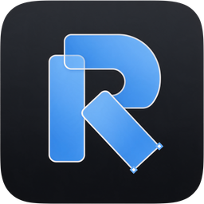
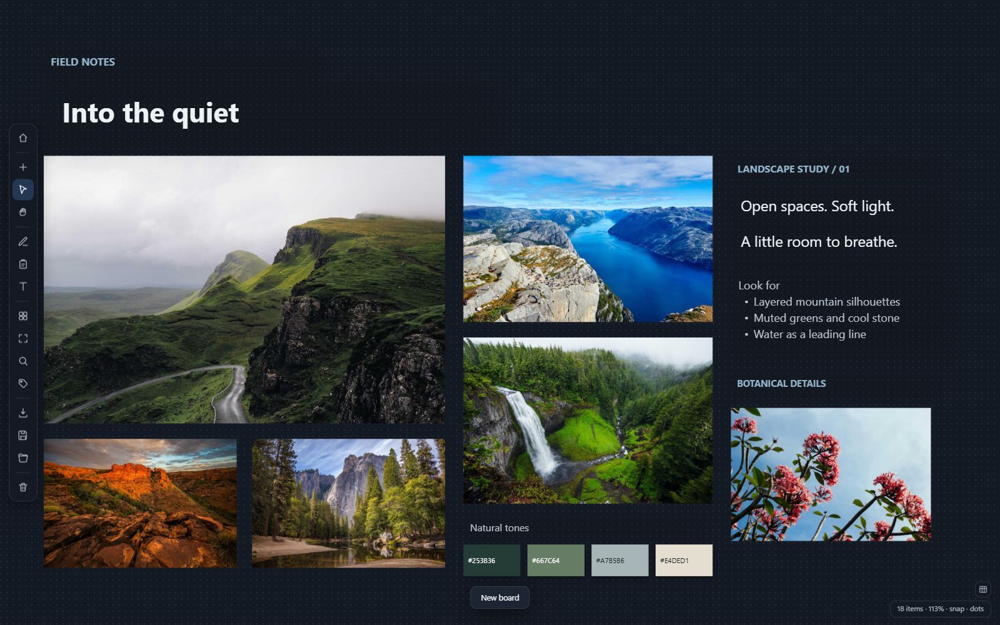
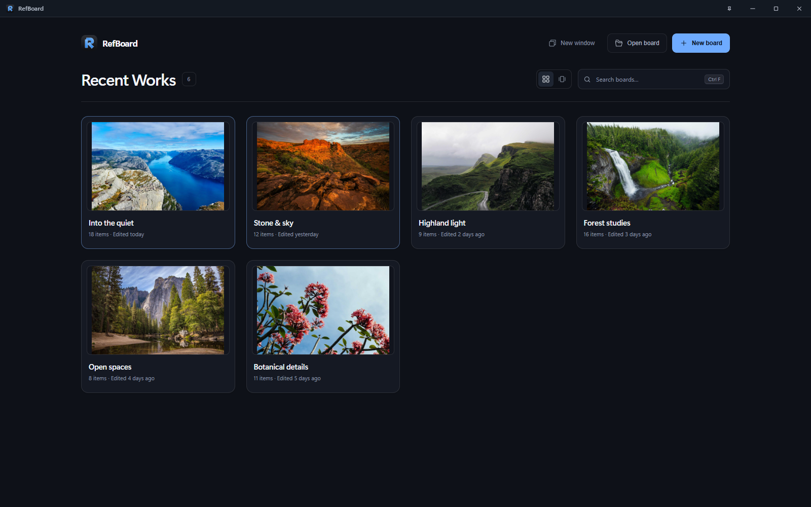
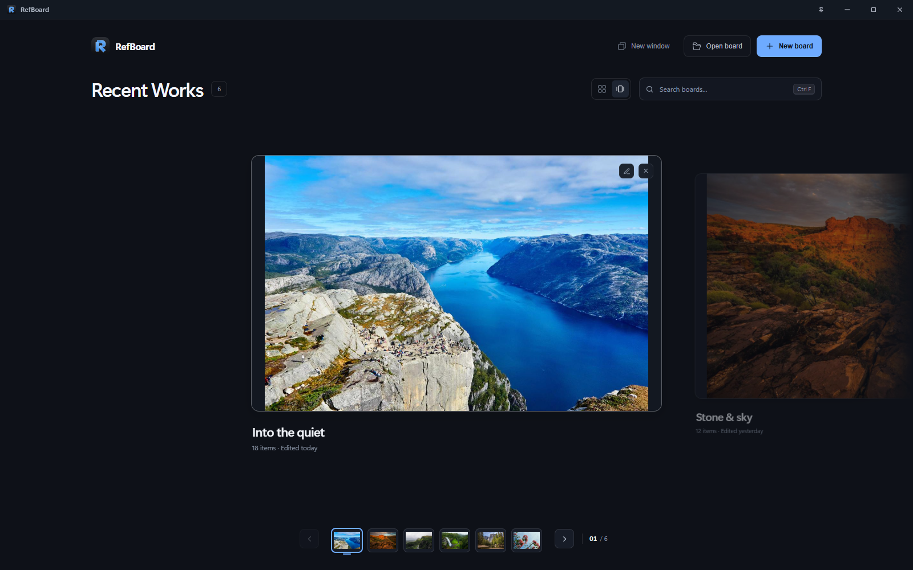

<p align="center">
  
</p>

<h1 align="center">RefBoard</h1>

<p align="center">
  <b>A free moodboard and reference workspace for Windows.</b><br>
  Collect images, explore ideas, and keep your references beside your work.<br>
  No account. No subscription. Your boards stay on your PC.
</p>

<p align="center">
  <a href="https://github.com/sounak1125/RefBoard/releases/latest"></a>
  <a href="https://github.com/sounak1125/RefBoard/releases"></a>
  
  <a href="build/license.txt"></a>
</p>

<p align="center">
  <a href="https://github.com/sounak1125/RefBoard/releases/latest"><b>Download for Windows</b></a>
  &nbsp; · &nbsp; <a href="#features">Features</a>
  &nbsp; · &nbsp; <a href="#keyboard-shortcuts">Shortcuts</a>
  &nbsp; · &nbsp; <a href="https://github.com/sounak1125/RefBoard/issues">Report a bug</a>
</p>

<p align="center">
  
  <br><sub>A place for images, notes, and the details that connect them.</sub>
</p>

## Why RefBoard

Built for artists, designers, and anyone who works with visual references. Bring a collection together, make sense of it, and keep it close while you create.

- **Collect without friction.** Paste from the clipboard or drag images and files onto the canvas. Imported images retain their original data and quality.
- **Arrange freely.** Move, resize, rotate, and group references, or pack them into a tidy layout with one key.
- **Keep your work local.** Boards and images are stored on your PC. Working on a board does not require an internet connection.
- **Stay in your flow.** Pin RefBoard above other windows, switch between boards, and choose a compact or always-visible toolbar.

## Get started

1. Download **`RefBoard-Installer-<version>.exe`** from the [latest release](https://github.com/sounak1125/RefBoard/releases/latest) and run it. The standard **`RefBoard-Setup-<version>.exe`** installer is also available there.
2. Open RefBoard, choose **New board**, and drop in a few images. You can also paste with **Ctrl+V**.
3. Press **P** to arrange your references, **F** to fit them in view, and **Ctrl+S** to save your board.

Installed release builds check for updates on startup by default. When an update is ready, RefBoard offers to restart and install it. Update preferences are in **Settings → System**.

<details>
<summary>Windows SmartScreen during installation</summary>

RefBoard is not currently code-signed, so Windows may display “Windows protected your PC.” If you downloaded the installer from this repository's release page and want to proceed, choose **More info → Run anyway**.

</details>

## Features

### Your boards, easy to find

Home keeps recent boards within reach, with visual previews, pinned favorites, and search by board name or folder. Rename a board or reveal its file in Explorer directly from its card.

<p align="center">
  
  <br><sub>Classic Grid keeps your reference library in view.</sub>
</p>

Prefer to browse one board at a time? Switch to **Focus Flow** for large previews and a thumbnail strip.

<details>
<summary>See Focus Flow</summary>

<p align="center">
  
</p>

</details>

### More than a collection of images

Keep the thinking alongside the references. Add text notes, lists, drawings, and arrows; tag images to find them again; and pull a color palette from a reference.

| Tool | What you can do |
|---|---|
| **Arrange & group** | Resize with proportions intact, rotate, snap to nearby items, and organize references in named groups. |
| **Notes & drawing** | Add formatted notes, checklists, pen marks, and arrows to explain an idea. |
| **Image tools** | Crop, flip, view in grayscale, and sample colors with the eyedropper. |
| **Tags & search** | Label references, filter by tag, and search within a board. |
| **Navigation** | Zoom at the cursor, pan across the canvas, fit the selection or whole board, and jump around with the minimap. |
| **Appearance** | Choose from six dark themes, toggle the dot grid, and keep tools compact or always visible. |

### Take your references into your work

- **Copy at full resolution.** Copy a reference back to another app; copying several selected items creates a combined image.
- **Export the board.** Save a PNG at 1×, 2×, or 4× with a transparent, dark, or white background.
- **Export individual images.** Keep the original format or choose PNG, JPEG, or WebP, with optional cropping and export order controls.
- **Work beside other apps.** Use the title-bar pin controls to keep references visible, and open up to four RefBoard windows.
- **Keep making changes.** Undo and redo edits, and use configurable autosave while you work.

## Saving and sharing boards

RefBoard 2.1.0 saves each board as a pair:

```text
Landscape study.refboard          Board layout, notes, tags, and preview
Landscape study.refboard.images   Original image data
```

**Keep both files together when moving, sharing, or backing up a board.** Saving writes new or changed image data without rewriting every original. Renaming from Home renames both files.

Older single-file boards still open. On their next save, RefBoard converts them to the new format and keeps the previous file as a `.refboard.bak` backup. The new format requires **RefBoard 2.1.0 or later**. See [board files and compatibility](docs/BOARD_FILES.md) for details.

## Keyboard shortcuts

| Action | Shortcut |
|---|---|
| Paste / copy references | **Ctrl+V** / **Ctrl+C** |
| Save / save as | **Ctrl+S** / **Ctrl+Shift+S** |
| Open a board | **Ctrl+O** |
| Pack references | **P** |
| Fit selection or board | **F** |
| Pan / zoom | **Space+drag** / **Mouse wheel** |
| Add a text note | **Shift+T** |
| Group / ungroup | **Ctrl+G** / **Ctrl+Shift+G** |
| Search / tags | **Ctrl+F** / **Ctrl+Shift+T** |
| Toggle the minimap | **M** |
| Undo / redo | **Ctrl+Z** / **Ctrl+Shift+Z** |
| Export board / images | **Ctrl+E** / **Ctrl+Shift+I** |

Press **?** on a board for the full shortcut reference.

## Run from source

On Windows, with Node.js 22 and npm installed:

```bash
git clone https://github.com/sounak1125/RefBoard.git
cd RefBoard
npm ci
npm start
```

RefBoard uses vanilla HTML, CSS, and JavaScript, packaged with Electron. Run `npm test` for the unit and contract checks. `npm run dist` runs those checks and builds the Windows installer into `dist/`.

Contributor references: [maintaining and releasing](docs/MAINTAINING.md) · [board storage](docs/BOARD_FILES.md) · [screenshot capture and photo credits](assets/readme/README.md).

## Feedback and contributing

Found a bug or have an idea? [Open an issue](https://github.com/sounak1125/RefBoard/issues). Pull requests are welcome. If RefBoard is useful to you, a star helps others discover it.

## License

[MIT](build/license.txt). Made by [Sounak](https://github.com/sounak1125).

<sub>All screenshots use public sample photographs and fictional board data in an isolated app profile. No personal boards or history are shown. <a href="assets/readme/README.md">Photo credits</a>.</sub>
